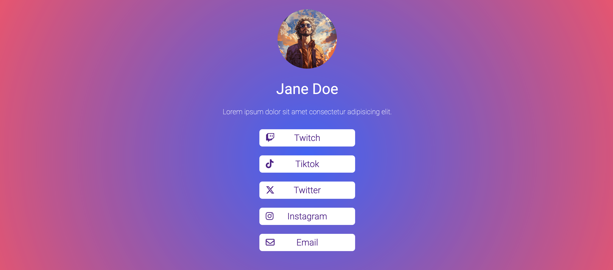

<h1 align="center">Linktree template</h1>

 <a align="center" href="https://ctrlaltsudo.github.io/nft-preview-card-component-main/">Demo</a>

<h2 align="center">Project Screenshot<h2>

  </img>

## What is this? 
This is a linktree template i originally made for a friend but have decided to publish it on Github for anyone to use, you're welcome! 

